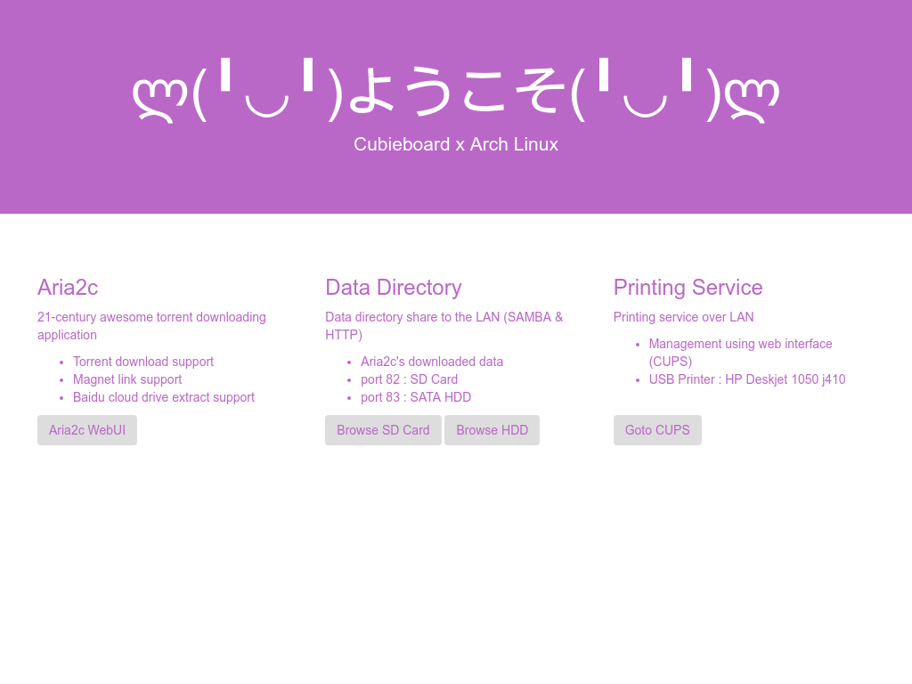

# Cubie_Webhome

## Configuration

## Samba

Since Samba is update to version `4.9.3`, we no longer require to use `smbd`, `nmbd` and `winbind` separately by `systemd`. Just calling command `sudo systemctl start smb` for starting Samba service. 

#### /smb.conf

Samba configuration file, should be place to `/etc/samba`

#### /fstab

Auto mount HDD during boot, should be place to `/etc`

## Nginx

All pages are store under `/usr/share/nginx`. Notice that I  enable `fancyindex` feature of Nginx to display resources for user. This function may require to re-compile Nginx with extra flags (Nginx Binary Arch Linux is not included this feature. Anyway you should try to find it from AUR first).

#### /nginx/conf/nginx.conf

Nginx configuration file, place to `/etc/nginx`(default) or `/usr/local/nginx/conf` (custom self compiled)
P.S. Nginx Systemd Unit is calling `/usr/local/nginx/conf`

#### /nginx.service

The systemd Unit for calling `/usr/local/nginx/sbin/nginx`

#### /cubie_webhome

Cubieboard Webhome main portal. It should be host and place to `/usr/share/nginx`

## SSH

#### /motd

'Message of the day'
Printing cool ascii art when user login.

## Aria2

#### /aria2-start

Manual starting Aria2c rpc, with `aria2-webui`. It should place to `usr/bin`

#### /aria2-c.conf

Aria2c configuration file, should place to `/etc`

#### /aria2-webui

Aria2 web-based UI. Should be host by Nginx. Place to `/usr/share/nginx`

## Printer

Use samba to share USB printer -> behave like a network printer. Using _CUPS_ for management.

#### /printers.conf

Place to `/etc/cups`

## Issue

- __Q__: I connect 2.5 HDD to Cubieboard, but system can't show the drive.   
  __A__: It can be _Link Error_. If you can't see your drive using `fdisk` or `lsblk`, then check your boot log with `dmesg`, if it shows something like "_link is slow to respond_" and "_errno=-16_"  or "_errno=-32_", that means some problem occur of the link.

  You should make sure your SATA cable is workable first.
  If SATA cable is fine, then it can be the power supply problem (voltage too low). For 2.5 inch HDD/SSD, it requires at least 5V 2A;for 3.5 inch HDD, it requires both 12V and 5V power.
  If you think power supply is fine, but still not working, try giving power with the mini USB-type B port (my case is the jack for power input suck)
